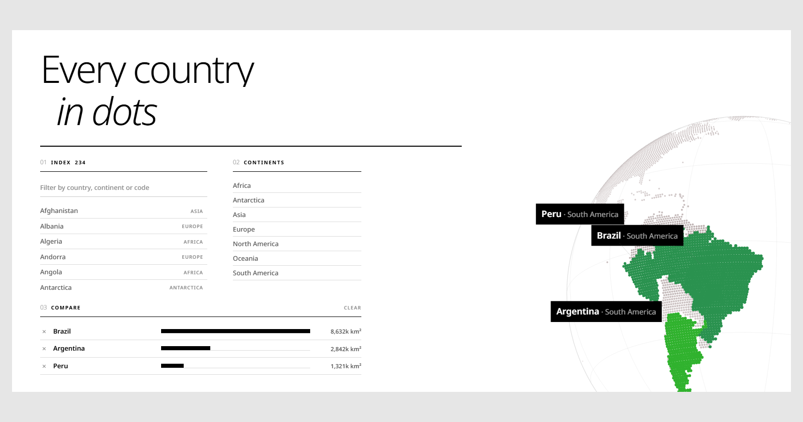

# Terra Index

**[dotted-globe-card.vercel.app](https://dotted-globe-card.vercel.app)** —
and a comparison is a link: [Brazil, Argentina and Peru](https://dotted-globe-card.vercel.app/?pin=Brazil,Argentina,Peru).

[](https://dotted-globe-card.vercel.app)

A plate of every country on Earth, drawn in ink. The map is grey, the
interface is grey, the type is black — so the **only colour on the page is the
country under your pointer**, which leaves the map and takes the colour of the
ground it actually stands on: green where it rains, yellow where it does not,
blue where it is frozen. The globe drifts on its own and a drag is a throw.

**No framework. No build step.** One dependency — Motion, for the entrance —
vendored into the folder rather than pulled from a CDN, so the page still runs
with the network off and from a `file://` path. Every
asset on the page is drawn in markup: no images, no icons, no SVG.

## Run it

```bash
npm start
```

That is `npx serve -l 3000 .` — nothing gets installed into the project.
Or use anything else that serves a folder:

```bash
python -m http.server 3000
```

Or just open `index.html` in a browser. The scripts are plain `<script>` tags,
not ES modules, precisely so `file://` works too.

## Sharing a view

`?pin=` opens with countries already lit, so a comparison is a link:

```
/?pin=Brazil,Argentina,Peru
```

Names are matched exactly as they appear in the list, up to five, and anything
unrecognised is ignored rather than treated as an error.

The social preview image is a screenshot of exactly that, taken with headless
Chrome against a local server — the point of the picture is the idea, and the
idea is three countries lit out of a grey planet with their areas underneath:

```bash
chrome --headless=new --disable-gpu --hide-scrollbars   --window-size=1600,840 --virtual-time-budget=4500 --screenshot=og.png   "http://localhost:3000/?pin=Brazil,Argentina,Peru"
```

The virtual time budget matters twice over. Too little and the shot lands
mid-entrance with the headline still masked, or mid-flight with the camera
between where it was and the countries asked for. Too much and every extra
second is another sixty frames of eighteen thousand dots rendered in software:
at 2× scale a twelve-second budget took over two minutes. 4.5 seconds at 1× is
about where both ends are satisfied.

## The files

| file | what it is |
| --- | --- |
| `index.html` | the plate |
| `style.css` | the plate: ink on paper, hairline rules |
| `text-anim.js` | the Motion entrance, and the rolling headline |
| `country-list.js` | the filter box and the 234-row list |
| `globe.js` | the globe: projection, drawing, drag, focus, colour |
| `world-data.js` | generated — 206 rings, 18,538 land cells, 234 countries |
| `vendor/motion.min.js` | Motion 11.18.2, vendored (65 KB) |
| `tools/build-world.js` | regenerates `world-data.js` from Natural Earth |

## How exact are the borders?

Exact, with one honest caveat that is about the dots and not about the map.

**The borders are the survey, not an approximation of it.** Every dot is placed
by asking Natural Earth's 1:50m admin-0 polygons "which country contains this
point". There is no nearest-city guessing and no hand-tracing. Land and country
come from the same source, so a coastline and a border cannot disagree with
each other — they are the same edge.

**The grid is what is coarse.** Dots sit on a 0.8° lattice, about 89 km at the
equator. Every cell covers the same area of sphere (each parallel is divided
into `n ∝ cos(lat)` cells), which has a useful side effect: **dot count is
directly proportional to land area**, so the data can be checked against
published figures without trusting the code that made it.

| country | dots | implied area | published | error |
| --- | --- | --- | --- | --- |
| Russia | 2126 | 17.12 M km² | 17.10 M | +0.1% |
| Canada | 1246 | 10.03 M | 9.98 M | +0.5% |
| United States | 1201 | 9.67 M | 9.83 M | −1.7% |
| China | 1187 | 9.56 M | 9.60 M | −0.4% |
| Brazil | 1072 | 8.63 M | 8.52 M | +1.4% |
| Australia | 972 | 7.83 M | 7.74 M | +1.1% |
| India | 398 | 3.21 M | 3.29 M | −2.5% |

Separately, the nearest dot to each of 55 world capitals names the right
country in 53 cases. The two that "miss" are the grain doing its job: the
nearest dot to Rome is Vatican City's, and the nearest to Vientiane fell on the
Thai bank of the river that forms the Laos border.

**60 countries are smaller than one cell** — Singapore, Malta, Bahrain, Monaco
and so on. They are not dropped. Each gets one dot at its own true coordinates,
so every country on the map is present and can be pointed at. That dot is
exactly placed; it is simply one dot rather than a shape.

**Disputed borders follow Natural Earth's de-facto view** (Crimea, Kashmir,
Western Sahara, Taiwan). It is a defensible default, not a position. Continents
are Natural Earth's too, which is why Russia is one colour rather than two:
a country gets one continent, and NE files it under Europe.

To rebuild after changing the grain or the source:

```bash
curl -LO https://raw.githubusercontent.com/nvkelso/natural-earth-vector/master/geojson/ne_50m_admin_0_countries.geojson
node tools/build-world.js ne_50m_admin_0_countries.geojson
```

## The hero

Laid out after a premium e-commerce hero — light page, white rounded
container, a top bar of brand / links / search, and one large rounded hero
below it with the copy bottom-left, a floating card right and pagination dots
bottom-centre. Three places it departs from that reference on purpose:

**The hero is light and the type on it is dark.** A reference hero is a
photograph under a black scrim, which is what lets white type sit on it. Ours
is a data visualisation — the dots *are* the content — and a scrim over them
would dim the only thing the page exists to show. Inverting the contrast keeps
the hierarchy and keeps the map readable; the reference's own treatment would
not have.

**Almost nothing has a shadow.** The rest of the design is flat and stays
flat. The one exception is the floating card, because "floating" is a claim
about elevation and a card that makes it with a border alone is just a box in
the corner.

**There is no play button, wishlist, cart or avatar.** This is not a shop and
it has no video. Those slots went to the things this page actually has: a
search over all 234 countries, and a hint that the sphere can be grabbed —
which retires itself the first time anyone drags, and after twelve seconds
regardless.

The reference's pieces map onto real functionality rather than being
reproduced empty:

| reference | here |
| --- | --- |
| nav links | the seven continents — the menu **is** the filter |
| each link's dropdown | that continent's countries; pointing at one turns the globe to it |
| hero image | the globe |
| floating product card | whatever is under the pointer — name, region, cell count, area |
| play button | "drag to turn" |
| search field, carousel dots | gone — see below |

**The search field and the pagination dots were both removed.** Between them
they were doing one job — get me to a country — in two places, and neither
said what was in there: a dot is a dot, and an empty search box is a promise
that you already know the name you are looking for. Seven named continents
that open onto their countries say it on the face of the control, and one
control is easier to learn than two.

The panel is anchored to the **nav**, not to each button. Anchored to a
button, the rightmost continent's menu hangs off the edge of the shell;
anchored to the nav it never can, at any width. Its column count follows its
length — Antarctica is one name and Africa is fifty-four, and neither wants
the other's shape.

Hover alone never *opens* a menu; a menu that opens because the pointer passed
over it is a menu that opens by accident. Click opens it — and once one is
open, moving along the row switches between them without another click, which
is the behaviour a menubar has had for thirty years.

The card has a **resting state** and updates on keyboard focus as well as
hover, because information that only exists on hover does not exist for
everyone. Each dot carries its continent's name as real text, positioned
off-screen and surfaced on hover *and* focus — a dot with no accessible name
is a control nobody can use. Area comes out of the dot count directly: every
cell covers the same area of sphere, 8,052 km² apiece.

**On the overflow the brief asks about:** measured at 320, 390, 768, 1024,
1280 and 1440 — `scrollWidth` never exceeds the viewport. The one thing that
*is* wider than the screen is the globe canvas, which the hero clips on
purpose. The real fix when it did overflow was one property in one place:
`min-width: 0` on the shell, because a flex item will not shrink below its
content and the top bar's min-content width is wider than a phone.

## How the colour works

The globe is painted by terrain rather than by politics, in three families:
**green where it rains, yellow where it does not, blue where it is frozen.**
They are not decoration on top of the zones — they *are* the zones. What makes
that possible without a land-cover dataset is that Earth's biomes are mostly
**zonal**: they run in bands around the planet, because what sets them is how
much sun a latitude gets and where the atmosphere's circulation puts the rain.

Reading left to right across Africa gives green, yellow, green — the Congo, the
Sahara and the Mediterranean, in that order, from nothing but latitude.

Three things are modelled, and they are the three a latitude actually
predicts:

- **The ice**, fading in above about 60°, rather than starting at a line.
- **The arid belt** at 25° north and south. That is not a coincidence — it is
  where the Hadley cell descends, dry, and it is why the Sahara, Arabia, the
  Thar, the Kalahari, the Atacama and the Australian interior all sit the same
  distance from the equator.
- **The green in between**, deepest at the equator where the same circulation
  dumps its rain, cooling toward teal by the time it reaches the
  mid-latitudes.

What the model **cannot** know is longitude, so it has no way to tell the
Sahara from India at 25°N, and India comes out as yellow as the Sahara. That is the
honest limit of a zonal model; fixing it needs a land-cover raster, not a
cleverer formula.

The bands are computed smoothly and then quantised into 22 steps, because
colour is a canvas state change and one per dot would be eighteen thousand of
them a frame.

**There is no sea.** The water is the page showing through. A flat blue disc
was tried and dropped: filling the ocean makes the globe the heaviest object
on a white page, and the dotted land — which is the actual subject — ends up
as texture on top of a large blue circle rather than as the thing being looked
at. Leaving the water empty also lets the land keep its own colours against
paper rather than against a colour that competes with all of them. It is the
right answer for a flat design too: a shaded sphere is the one place depth
would have crept back in.

That puts the whole job of *being a sphere* on two sets of lines, so both were
strengthened: the limb is now the silhouette rather than a hairline, and the
graticule runs at nearly twice its old weight. Without a fill behind them, at
their old weights the dots read as a flat scatter rather than as something
wrapped around a ball. Both fade back while a country is pointed at, so the
scaffolding gets out of the way of the answer.

**Pointing at a country drains the colour out of everywhere else** and paints
that one country in the interface's own accent. The highlight has to come from
outside the map's range — green, yellow and blue are all spoken for by the
terrain — or it reads as another kind of ground rather than as a selection. Red
is the one place left to go. Dimming the rest is a
stronger way to pick something out than brightening one thing, and it is
gentler here than it was over a political map: taken too far it bleaches the
planet, and a green-and-blue Earth going grey is a bigger loss than a colour
key going grey. The list does the same at the same moment: rows that are not
under the pointer step back to 45%.

## How it works

**Canvas, not SVG.** The first version drew one `<circle>` per dot and wrote
four attributes to each every frame. Fine at two thousand dots, impossible at
eighteen thousand.

**No 3D library.** three.js is several hundred kilobytes to do what is a few
multiplies per dot here. Each dot's place on the sphere is precomputed once as
a unit vector, so turning the globe is a 2D rotation of that vector with **one
sine and cosine per frame** rather than four per dot.

**Batching is why seven colours matters.** Setting `fillStyle` or
`globalAlpha` costs a canvas state change, so the depth fade is quantised into
18 bands and each *group* × band is drawn as a single path. Seven continents
plus whichever country is rising is about 150 fills a frame. Colouring every
country individually would have been 4,200.

**The label is a black plate.** It was a frosted-glass panel for a while — a
patch of the globe copied to a scrap canvas, blurred there and drawn back under
a translucent fill — which existed to keep the words readable over a field of
dots. A solid black rectangle does the same job by simply not letting the dots
through, and it took the scrap canvas, the per-frame blur and the question of
whether the surface behind was light or dark out with it. It reads
`Country : Region` on one line, square-cornered, and zooms in and out on `e`,
the same eased focus progress the globe itself grows on — one gesture rather
than two that happen to overlap.

**A pointed-at country does not fade with depth.** Everything else does, which
is what gives the sphere its roundness, but the one country being asked about
came out at 72% near the limb and full strength in the middle — dimmest exactly
when it had been turned to and was still arriving.

**The zoom is an S-curve.** Progress runs linearly on the clock and
`smoothstep` (`t²(3−2t)`) bends it. Exponential smoothing — the usual
`x += (target - x) * 0.1` — can only ease *out*; it leaves fastest on the first
frame, which is the opposite of what an ease-in-out needs.

**One lift per country**, not one shared value. With a single value, moving the
pointer from Chad to Sudan dropped Chad in a single frame and raised Sudan
already standing — the swap was the one moment in the whole interaction with no
animation in it.

**It measures itself until it can.** A tab opened in the background never lays
out, so a canvas sized entirely by CSS reads as zero wide at mount and a
`ResizeObserver` has nothing to observe a change *from*. Every frame re-checks,
so the first frame after the tab is looked at puts it right. This was a real
blank-globe bug, not a hypothetical.

## Making it yours

```js
mountGlobe(document.getElementById("globe"), {
  centreLng: 60,    // which meridian faces you at rest
  centreLat: 18,
  draggable: true,
  palette: "mono",  // "mono" for the ink globe, omit for full colour
  cropTo: ".plate", // the element that visually crops the canvas;
                    // the country label is kept inside THAT box
});
```

- **The land colours** — four `{h, s, l}` triples at the top of `globe.js`:
  `TROPIC`, `TEMPERATE`, `ARID`, `ICE`. Everything else is interpolated
  between them by latitude, so changing one moves a whole climate band and
  the gradients into its neighbours come along. `MONO` is the same four in
  grey, and is what `palette: "mono"` selects.
- **Colour on hover** — that is the *colour* set painting one country while
  the rest of the globe stays in `MONO`. Drop the `palette` option and the
  whole globe is in colour all the time.
- **The page** — every colour is a token at the top of `style.css`. There are
  three that matter: `--paper` (the plate), `--ground` (the page behind it)
  and the `--ink` scale (every line and every word). The design has no
  shadows and no fills by choice, so those tokens really are the whole
  palette — see *Design notes*.
- **Grain** — `STEP` in `tools/build-world.js`. Halving it quadruples the dots;
  0.8 is where the sphere reads as *dotted* rather than as *speckled*, and
  0.4 is about where a laptop starts to notice.
- **Drive it from anything** — the list is decoupled from the globe by one
  window event:

  ```js
  focusCountry("Japan");   // or dispatch it yourself:
  window.dispatchEvent(
    new CustomEvent("globe:focus", { detail: { country: "Japan" } })
  );
  focusCountry(null);      // let go, resume the drift
  ```

- **Pin and compare from anywhere** — same shape as focus, with a list:

  ```js
  pinCountries(["Brazil", "India"]);  // lights both, aims between them
  window.dispatchEvent(
    new CustomEvent("globe:pin", { detail: { countries: ["Brazil"] } })
  );
  pinCountries([]);                   // let them all go
  ```

- **Read the country table** — `GLOBE_COUNTRIES` is on `window`: name, ISO code,
  continent, sovereign state, dot count, and both colours. Dot count is area:
  every cell on the grid covers the same 8,052 km², which is how the compare
  bars are drawn. `GLOBE_CONTINENTS`, `GLOBE_BIOME` and `GLOBE_BIOME_MONO` are
  there too.

## Notes

- Respects `prefers-reduced-motion`: the idle drift stops, everything else stays.
- Stops drawing entirely when scrolled out of view (`IntersectionObserver`).
- Device pixel ratio is capped at 1.5 — a 1240×820 canvas at 2× is four million
  pixels to clear every frame, and past 1.5 the dots look no sharper.
- Keyboard works throughout: the filter box takes Enter to jump to the first
  match, and the list rows fire the same focus on `focus` as on hover.
- Territories are listed after sovereign states and labelled with whose they
  are — Greenland/Denmark, Åland/Finland. Natural Earth's own `TYPE` field is
  not the right discriminator here (it calls Jersey, Aruba and Hong Kong
  "Country"); comparing sovereign to administrator is.

## Licence

MIT for the code — see `LICENSE`. Country borders are
[Natural Earth](https://www.naturalearthdata.com/) 1:50m admin-0, public
domain, no attribution required (given here because it is the right thing to
do). Motion is MIT, vendored at `vendor/motion.min.js`. Noto Sans is served
from Google Fonts under the SIL Open Font License.

There are no images on the page at all — not one ``, no icons, no SVG —
so there is nothing else to license. Every surface is markup, CSS, or drawn
into the canvas. It can be lifted whole.

## Design notes

**Flat design**, from the IxDF list: two dimensions, bright colour, clean type,
and no gradient, shadow, texture or bevel anywhere. Those properties are not
set to `none` in the stylesheet — they are absent from it, which is the only
version of that rule that survives a few edits.

With depth gone, three things do all the work:

- **Flat colour separates.** A white surface on a grey ground, divided by 1px
  rules. Nothing floats; it sits.
- **Type makes the hierarchy.** Size, weight and letter-spacing are the whole
  toolkit, so they run at full strength — a 46px 700 next to a 10px 600 tracked
  to 0.16em, with nothing in between hedging. The tracking runs in opposite
  directions on the two: wide on the small one, tight on the large one, which
  is what makes each look set rather than merely scaled.
- **One bright colour, used flat.** Vermilion at full saturation, on small
  areas only: the eyebrow, the 2px rule under each heading, and every hover and
  focus state. In a flat design bright colour replaces lighting, which means it
  has to mean something — here it means *this responds to you*. That is also
  why Oceania was moved off hue 8: a continent permanently painted the
  interface's accent colour quietly breaks that promise.

**No icons and no images.** `document.querySelectorAll("svg").length` and
`document.images.length` are both 0. Every label is a word.

## The entrance

A flat page has no depth to animate, so the entrance is made of the same things
the design is made of: position, and the edge of a box. Every reveal is one
shape sliding up from behind a mask — nothing fades in from nowhere, nothing
scales, nothing blurs. Words come from under the line they sit on, which is
where words come from when a page is being set.

The split is done in `text-anim.js` rather than with a plugin, because chopping
a string into masked words is eight lines and a page with one dependency should
not take a second one for that. It runs on `textContent` and rebuilds the
element, so the HTML source stays a readable sentence instead of a pile of
spans, and the original string goes back on as `aria-label` with the pieces
marked `aria-hidden` — a screen reader hears one sentence, not forty-one words.

Two details that are easy to get wrong:

- **The pre-hidden state lives in the stylesheet, not the script.** Set it from
  JS and there is one painted frame where the page is laid out and fully
  visible before it is hidden again, which is the flash the animation exists to
  avoid. The `.is-animating` class goes on before the timeline is built and
  comes off when it finishes, so a page whose script never runs is simply
  already there — and that is also the whole `prefers-reduced-motion` path.
- **The masks clip at 105%, not 100%.** A descender pokes below the box its
  mask is drawn from, and at exactly 100% it is still visible as a row of dots
  under the line.

## Two bugs worth recording

**The hover swap held, then popped.** Moving the pointer from one country to
the next, the one being left behind appeared to freeze for a beat and then
vanish in a single frame. The lift was easing out correctly the whole time —
the fault was where its *colour* was easing to. It mixed from the country's own
shade back toward its continent's **full** tone, while every other continent on
the sphere had been dimmed; so for the entire fade the outgoing country stayed
the brightest thing on a pale globe, which reads as a hold, and then snapped to
pale the frame its lift crossed the threshold to be dropped. The fade now ends
at the *quiet* tone, and the alpha step is scaled by `(1 - raised)` so a
country on its way down gives the dim back at exactly the rate it loses its
lift. One expression covers a raised country, a falling one and a continent
that was never raised, which is the only reason they cannot drift apart again.
Measured after the fix: per-frame change across the canvas during a swap decays
29.8 → 10.5 → … → 3.1 with no spike anywhere.

**One that only showed up in a screenshot**, now moot: the label panel used to
pick dark-or-light glass by reading the *ink* colour, assuming ink is either
clearly dark or clearly light. This page's graticule is mid-grey (`#8d8f89`,
luminance 142), which landed one point over the threshold and painted a black
panel in the middle of a white page. The right question was never what colour
the drawing is — it is what is behind it. The black plate that replaced the
glass does not need to ask at all, so the test is gone rather than fixed.

## A note on "Framer Motion"

The ink edition's entrance is built with **Motion**, which needs saying
plainly: Framer Motion *proper* is a React renderer, and neither page here has
React or is going to get any for an entrance. `motion` is the standalone build
from the same project and the same author — `animate()`, `stagger()`,
`spring()` — the identical engine with the React layer taken off. If this page
were React, the markup would carry `<motion.div>` and the timings in
`text-anim.js` would move across unchanged.

The entrance hit a bug worth writing down, and its predecessor on the
now-deleted colour edition hit the mirror image of it: **hiding the copy behind an animation makes the copy only
as reliable as the animation.** A GSAP version came back from a headless screenshot
completely blank — the process never advanced the ticker, so the class that
hides everything was never removed. Motion's came back with half its columns
still half-transparent — the failsafe had cleared the inline styles while the
animations, still live, wrote their in-progress values back over the top.

The fix is the same shape in both: **finish the animation, then clear what it
wrote** — `timeline.progress(1)` for GSAP, `animation.complete()` for Motion —
on a timer that does not depend on the animation clock running at all. The
words are never contingent on the decoration around them.

The comparison panel hit the same wall a third time and sharpened the rule.
Its entrance was given a timer that cleared the inline `opacity` and
`transform` Motion had written — and the panel still settled at 12% opacity
with a perfectly empty `style` attribute. Motion runs these through the Web
Animations API, and a live WAAPI animation paints over the cascade whether or
not anything is left inline; clearing the style attribute clears the evidence,
not the cause. So the timer now **cancels the animation object** and then
clears. That works here because every entrance on this page animates *from*
something *to* the element's resting CSS: the finished state and the
un-animated state are the same state, so cancelling lands on it exactly as
playing out would.

A bar has the mirror problem. The panel keeps its rows rather than rebuilding
them, because a bar created at its final width has nothing to transition from
and snaps; a kept row animates when the largest of the set changes. But that
makes the first paint of a new bar a two-step — `0%`, then the real width one
frame later — and one skipped frame leaves a country reading as having no
area. It is written twice, on `requestAnimationFrame` and on a short timer,
for the same reason as above.

## One typeface

Both editions are set entirely in **Noto Sans**. That is a constraint, not a
default: with a single family, weight and size have to carry the whole
hierarchy — 300 at 108px against 700 at 10px on the ink edition, with nothing
in between hedging — and the devices that would normally separate a heading
from a label (a second family, a serif, a mono) are simply not available.

It also means either page can be set in Thai, Devanagari or Greek without the
headline falling back to something else entirely, which a display serif would
not have survived.

## The rolling headline

The ink edition's second line cycles: *in dots / in ink / in order / on one
sphere*. It started as a shadcn/Tailwind React component and was **ported, not
copied** — this folder has no React, no Tailwind, no TypeScript and no build
step, and adding all four to cycle four words would cost more than the words
are worth. What survived is the idea (a fixed line, a rolling one, a mask);
what changed is every mechanism used to express it:

- **The step is measured, not the original's hard-coded `2rem`.** This title is
  a `clamp()` between 40 and 76 pixels, so there is no constant to write down.
  The step is the first item's own height, re-read on every tick and re-seated
  without animating on resize.
- **The item box is taller than the type it holds** — 1.2em of leading around a
  1em glyph — because the descender on "sphere" is clipped by a mask cut
  exactly to the line.
- **A spring, not a 700ms ease**, because everything else that moves on this
  page is one, and a single eased thing among springs reads as a different
  page.
- **No colours.** The original gives each line its own; here the design turns
  on colour appearing only under the pointer, so the roller stays in ink.
- **It stops when the tab is hidden.** A timer firing into a background tab is
  a small thing done wrong for no gain.
- **Two elements, not one.** The entrance moves `.roller`; the cycle moves
  `.roller-track` inside it. One `transform` cannot be written by two
  animations at once.

To run the original component instead, the project would need to be a React
one — `npx create-next-app@latest`, then `npx shadcn@latest init`, which sets
up Tailwind, TypeScript and the `@/components/ui` path the import expects.
That folder matters because shadcn's whole model is that components are copied
*into* your repo rather than installed from npm, and `components.json` points
every generated import at it; put the file elsewhere and `@/components/ui/...`
and `@/lib/utils` both miss.

## Comparing countries

Hovering answers one question — *what is this*. Comparing needs two things on
screen at once, and a pointer can only be in one place, so **a click pins a
country** and a second click lets it go. Up to five at a time.

The globe needed almost nothing for this: `lifts` was already a *list*, because
leaving one country and arriving at another had to happen simultaneously rather
than one cutting the other. Pinning is that list held open — a pinned country
is simply never told to come back down.

Two things it did need:

**Where to point the camera.** With several lit, it aims at the mean of their
directions — taken as a vector, not an average of longitudes, because
averaging 170° and −170° gives 0°, which is the far side of the planet from
both. But a mean is only meaningful while the set is tight: pin Brazil and
Australia and the mean points a quarter of the planet from either, with both
on the limb — the camera obediently framing the midpoint of two things and
showing neither. Two countries on opposite sides of a sphere cannot both be in
view, and no averaging fixes that. So inside 70° it frames them together;
wider than that it falls back to the one most recently clicked, because
whatever else is true, a click should show you what you just clicked.

**Labels that do not land on each other.** Pin two neighbours and their plates
are computed from anchors a few degrees apart, so the second covers the first's
name — precisely the case pinning exists for. Each plate drawn this frame is
remembered, and a new one steps up by its own height until it clears them all;
up rather than down, because the anchor is below the label, so moving away from
the country keeps the leader pointing at it instead of putting the plate over
the dots being compared.

**The answer is the bar chart, not the globe.** *Which is bigger* is not a
question a sphere answers well — a country near the limb is foreshortened to
nothing. The compare panel puts them in order with bars against the largest of
the set, and the areas come straight out of the dot count, since every cell
covers the same 8,052 km². Measured: Russia 17,119k km² against a published
17,098k; Algeria 2,399k against 2,382k.
